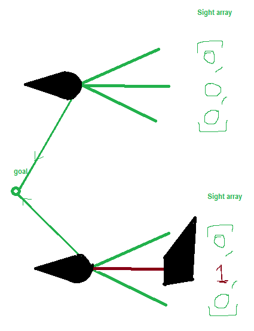
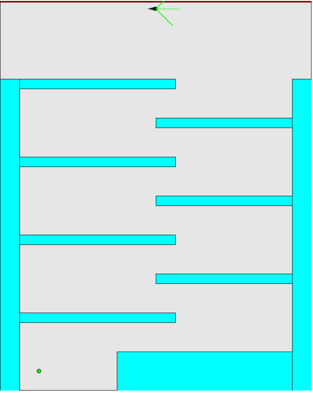

# Steering NEAT
 Using neuroevolution of augmenting topologies to train creatures to steer around obsticles, reaching a goal.
 
 ## Files:
 ### -ball.js:
 #### Class file that contains ball class.
 #### Well, what is a ball?
 
 
Balls have 4 inputs, 3 inputs are their sight array, being a 0 if there is nothing in their field of view at that angle, and 1 if there is.
The 4th input is a "desired vector" that shows them the angle to the goal.

The Balls also have 2 outputs, probability to turn left, and probability to turn right, if either are above 0.5, the Ball would turn in that respective direction.
 
 ### Result after 28-29 generations of training:
 
 
 ### I wanted to see what these little guys could really do, so i made the level a bit more difficult:
 
 
As we can see, with only about 25 generations of training, the creatures are able to reach the end.
